# Rhythm Rocket

Rhythm Rocket is an interactive game for music students and tutors to use to help develop their understanding of music rhythm and notation in a fun way.  
It is based on a game that I have used in my own teaching practice and all my students have enojoyed.  
It uses the combination of shapes, sounds and music notes to help build the students understanding of how these elements are linked and can be used in creative ways. And can be used by the student alone or used as a teaching tool by tutors in lessons.

Link to deployed site: https://bengilbertcodes.github.io/rhythm-rocket/

## Features

### Sitewide
* Footer 
  * Contains link to the Modal.
  * Allows users access to instructions at any time. 

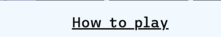

* Modal
  * Contains full instructions for the user to assist in use of the game functions

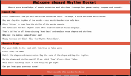

* Favicon
  * A site wide favicon featuring an image of a rocket taken from the background of the page.
  * This will provide an image in the the tabs header to allow the user to easily identify the website.

* 404 page
  * A cusom 404 page to be implemented and displayed if the user navigates to a broken link.
  * User is able to navigate back to the main site without the use of the browsers back button.

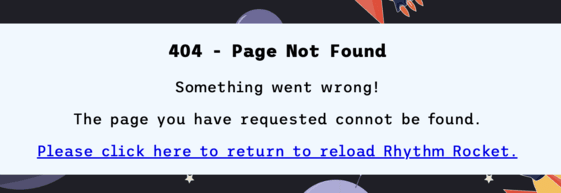

## The Game and User Experience UX

### Game 1 - Practice 
* Upon landing, the user is presented with a clear layout and the initial instruction of "Click Draw Card to Start".

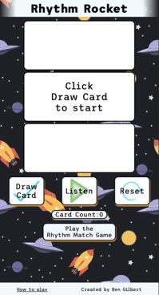

* When Draw Card is clicked images are displayed in the top and bottom large boxes and text in the middle box. Draw Card then changes to Next Card.

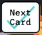
* These three cards are all linked (come from the same object in the allElements array)
* The first image is a coloured shape. The second box contains the name of the shape. The student should say the words and clap the rhythm of the words. The third box contains the music notation for that rhythm.

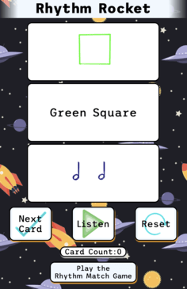

* User can click 'Listen' button to hear the rhythm to check against their own responses. 

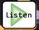

* User can then click 'Next Card' to load another three random cards and repeat the above process.
* A Card Count tracks the number of cards the user has been through.

* The game can be reset at any point by clicking 'Reset' button. 
* This clears the card boxes and resets the Card Count.

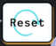

* When ready the user can click 'Play the Rhythm Match Game' to proceed to the next stage of the app.

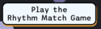

### Game 2 - Rhythm Match Game (True or False)

* After the button click the layout adjusts slightly, new True and False buttons replace Next Card and Reset and Play replaces Listen. More Practice and Restart Game appear at the base of the screen.

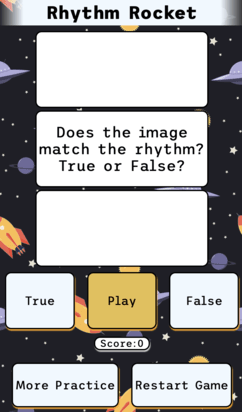

* User clicks 'Play' to start the game.

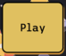

* The game boxes are populated with a random shape and music notation which may or may not match. 'Play' button changes to 'Next Card' button.

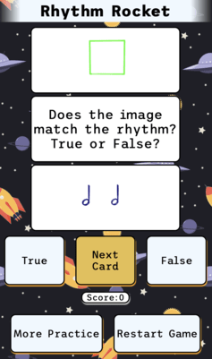

* Using knowledge obtained from the first part of the game, the user must work out whether the rhythm notation displayed matches that of the name of the shape. 
* User selects 'True' or 'False'. In this example, the answer is True. If User clicks 'True,'True' button turns green and score is updated to +1.

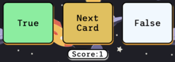

* If the user clicks a wrong answer (False in this case) then the button turns red and the score is not updated.

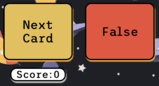